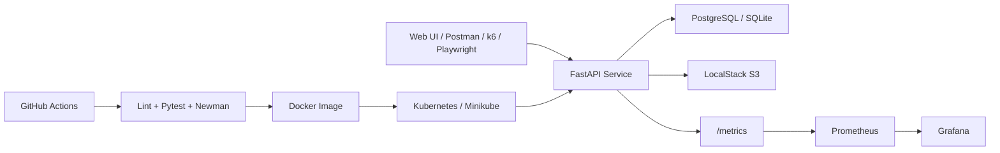

# Architecture Diagram

## Components

- `FastAPI Service`: menu, order, coupon and status workflows
- `PostgreSQL / SQLite`: order and menu persistence
- `LocalStack S3`: order summary archive target
- `Prometheus`: metrics scraping from `/metrics`
- `Grafana`: latency, throughput and error rate dashboard
- `GitHub Actions`: lint, test, build and smoke pipeline
- `Kubernetes / Minikube`: deployment target for demo
